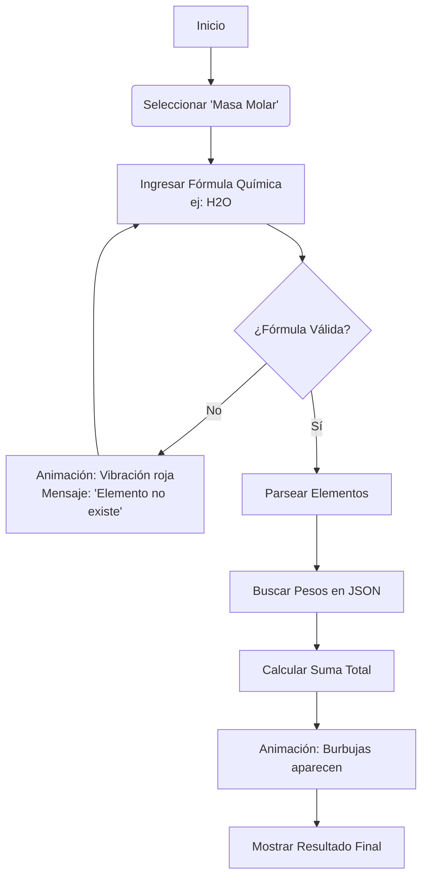
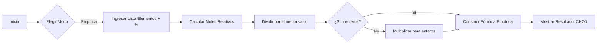

# PRD - Aplicación Educativa de Química (Estilo "Lluvia de Hamburguesas")

> **Estado:** En definición  
> **Objetivo:** Crear una calculadora web de química amigable, visualmente atractiva y accesible para estudiantes y padres, enfocada en relaciones de masa y fórmula empírica/molecular.

---

## 1. Visión General y Stack Tecnológico

### Objetivo Principal
Resolver variables químicas complejas mediante una interfaz lúdica, simplificada y altamente visual, eliminando la barrera de entrada técnica para usuarios sin conocimientos avanzados.

### Stack Tecnológico Seleccionado
*   **Core:** React + Vite (Rendimiento y modularidad).
*   **Lenguaje:** **TypeScript** (Seleccionado por robustez en cálculos).
*   **Estilos:** Tailwind CSS (Para estructura y mantenimiento rápido) + CSS Modules/Custom CSS (Para efectos visuales específicos).
*   **Animaciones:** Framer Motion (Librería ligera para React, permite animaciones fluidas "bouncy" tipo gelatina sin sobrecargar el navegador).
*   **Persistencia de Datos:** Archivos JSON estáticos (Tabla periódica completa interna). **Sin Base de Datos externa.**
*   **Infraestructura:** Hosting estático (Banahosting/Apache/Nginx). La app se compila a archivos estáticos (`/dist`).

### Requerimientos Técnicos Generales
*   **Validación Estricta:**
    *   Impedir entrada de caracteres inválidos en campos numéricos.
    *   Feedback visual inmediato (Bordes rojos, mensajes de ayuda tipo "globo de diálogo").
    *   Sanitización de entradas de fórmulas químicas (ej: convertir "h2o" a "H2O" o "H20" corregido).
*   **Responsive:** Debe funcionar en PC, Tablets y Móviles.

---

## 2. Identidad Visual y UX (Concepto "Flint Loco")

### Referencia Estética
Basado en la película "Lluvia de Hamburguesas" (Cloudy with a Chance of Meatballs).
*   **Concepto:** Laboratorio divertido, ciencia "pegajosa", botones físicos, cristal y neón.

### Paleta de Colores (Propuesta)
*   **Fondo:** Azul Oscuro/Gris Laboratorio (`#1e293b`) para resaltar los colores neón.
*   **Primario (Acción):** Naranja Ámbar neón (Estilo gelatina) o Verde "Radioactivo" amigable.
*   **Secundario (Información):** Azul Cian brillante.
*   **Acentos:** Rojo Alerta (para errores) y Amarillo Brillante (para resultados).

### Componentes de UI
1.  **Contenedores:** Bordes redondeados exagerados, efectos de cristal (Glassmorphism), sombras internas para dar profundidad.
2.  **Inputs:** Parecidos a cápsulas o tubos de ensayo.
3.  **Botones:** Estilo "Botón de emergencia" o palancas, con efectos de rebote al hacer click.
4.  **Tipografía:** Redondeada, gruesa, fácil de leer (Ej: *Nunito*, *Varela Round* o *Fredoka One*).

---

## 3. Definición Funcional (La Química)

### 3.1. Herramientas de Cálculo Requeridas
La aplicación funcionará mediante "Módulos" o "Calculadoras" independientes accesibles desde un menú principal.

#### A. Calculadora de Masa Molar
*   **Input:** Fórmula química (ej: `H2SO4`, `C6H12O6`).
*   **Proceso:**
    1.  Parsear el string (separar Elementos y Cantidades).
    2.  Buscar pesos atómicos en `periodic-table.json`.
    3.  Sumar `(Peso * Cantidad)` de cada elemento.
*   **Output:**
    *   Masa Molar Total (g/mol).
    *   Desglose paso a paso (ej: "H: 1.008 * 2 = 2.016").

#### B. Conversor de Moles <-> Gramos <-> Átomos/Moléculas
*   **Input Principal:** Fórmula del compuesto/elemento.
*   **Inputs Variables (El usuario llena UNO, se calculan los otros):**
    *   Masa (g)
    *   Moles (mol)
    *   Moléculas/Átomos (partículas)
*   **Constantes:** Número de Avogadro ($6.022 \times 10^{23}$).
*   **Validaciones:** No permitir valores negativos. Manejo de notación científica para números muy grandes.

#### C. Composición Porcentual
*   **Input:** Fórmula química.
*   **Output:** Gráfico circular (Pie Chart) o barras de progreso mostrando el % de masa de cada elemento en el compuesto total.

#### D. Calculadora de Fórmula Empírica y Molecular
*   **Modo 1 (Empírica desde %):**
    *   Input: Lista de elementos y sus porcentajes (ej: C: 40%, H: 6.7%, O: 53.3%).
    *   Output: Fórmula Empírica (CH2O).
*   **Modo 2 (Molecular desde Empírica + Masa Molar):**
    *   Input: Fórmula Empírica y Masa Molar real del compuesto.
    *   Output: Fórmula Molecular (ej: C6H12O6).

### 3.2. Manejo de Datos
*   **Base de Datos Interna (JSON):**
    *   Se usará un JSON local minificado para rendimiento.
    *   No requiere conexión a internet para cálculos una vez cargada la página.

---

## 4. Casos de Uso (Flujos Mermaid)

### Flujo 1: Cálculo de Masa Molar (Usuario General)
El usuario ingresa una fórmula y obtiene el desglose del peso.



### Flujo 2: Conversión Reactiva (Estudiante)
El usuario tiene gramos y quiere saber moles. El cálculo es automático.

```mermaid
sequenceDiagram
    participant U as Usuario
    participant UI as Interfaz
    participant Engine as Motor Químico
    
    U->>UI: Selecciona 'Conversor'
    U->>UI: Ingresa Compuesto (NaCl)
    U->>UI: Escribe en campo 'Masa' (50g)
    
    rect rgb(30, 41, 59)
        Note over UI, Engine: Proceso en tiempo real (onChange)
        UI->>Engine: Enviar (NaCl, masa=50)
        Engine->>Engine: Calcular Masa Molar (NaCl)
        Engine->>Engine: Moles = Masa / MM
        Engine->>Engine: Átomos = Moles * Avogadro
        Engine-->>UI: Retornar {moles, atomos}
    end
    
    UI->>U: Autocompleta campos 'Moles' y 'Átomos'<br>con animación de conteo
```



### Flujo 3: Fórmula Empírica (Avanzado)
Flujo para encontrar la fórmula más simple a partir de porcentajes.



---

## 5. Estructura del Proyecto (Preliminar)

```text
/src
  /assets        (Imágenes, iconos, fuentes)
  /components    (Botones, Inputs, Tarjetas de Resultados)
  /data          (periodic-table.json, common-formulas.json)
  /features      (Lógica específica de cada calculadora)
     /molar-mass
     /moles-converter
     /empirical-formula
  /hooks         (Lógica reutilizable: usePeriodicTable, useValidator)
  /pages         (Vistas principales)
  /styles        (Configuración global de Tailwind y animaciones)
  /utils         (Funciones matemáticas, formateadores de química)
```

